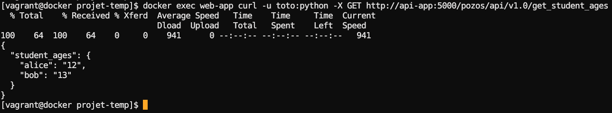
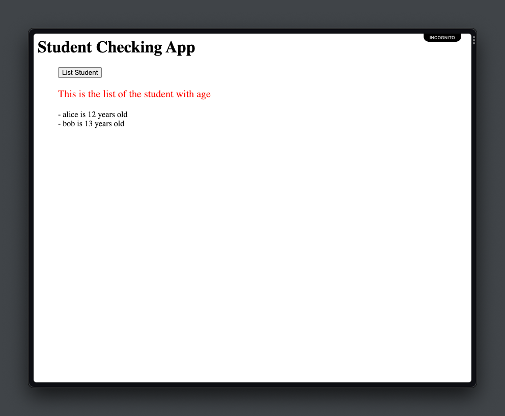
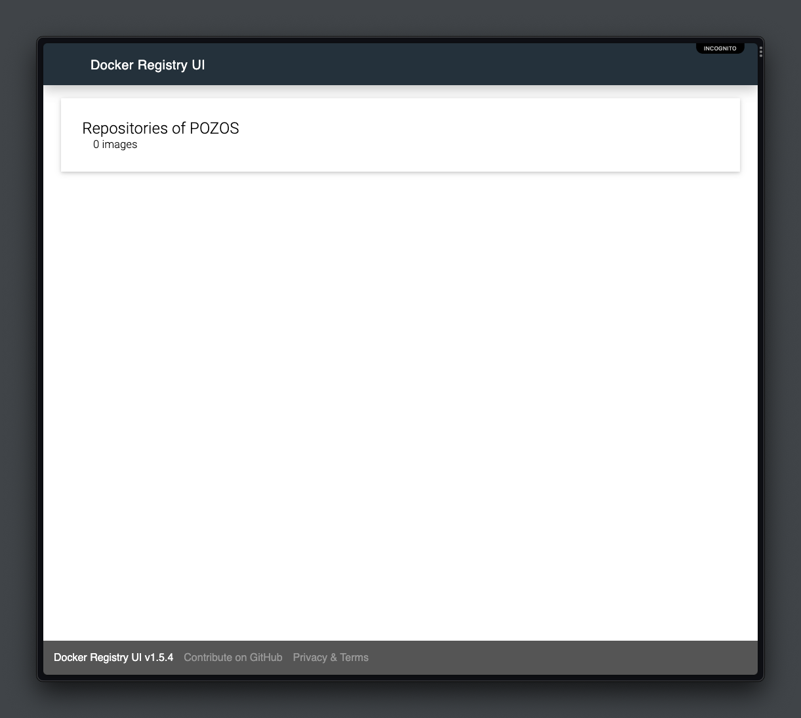
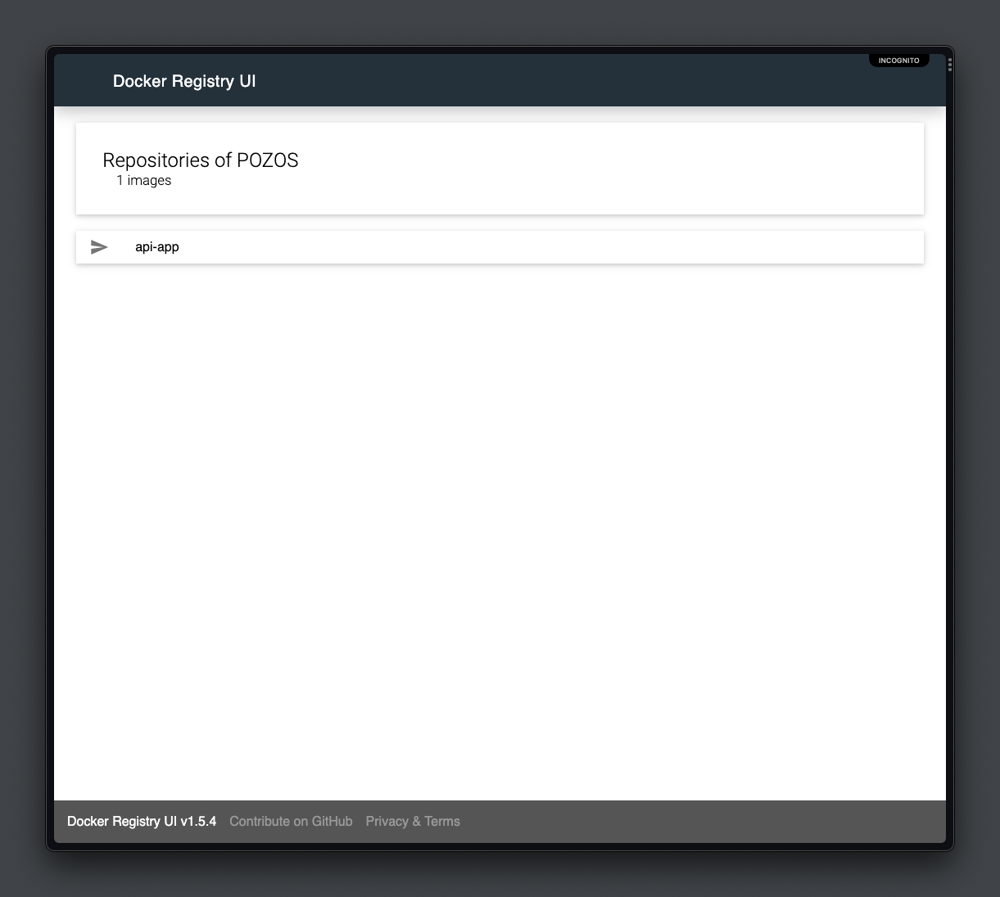
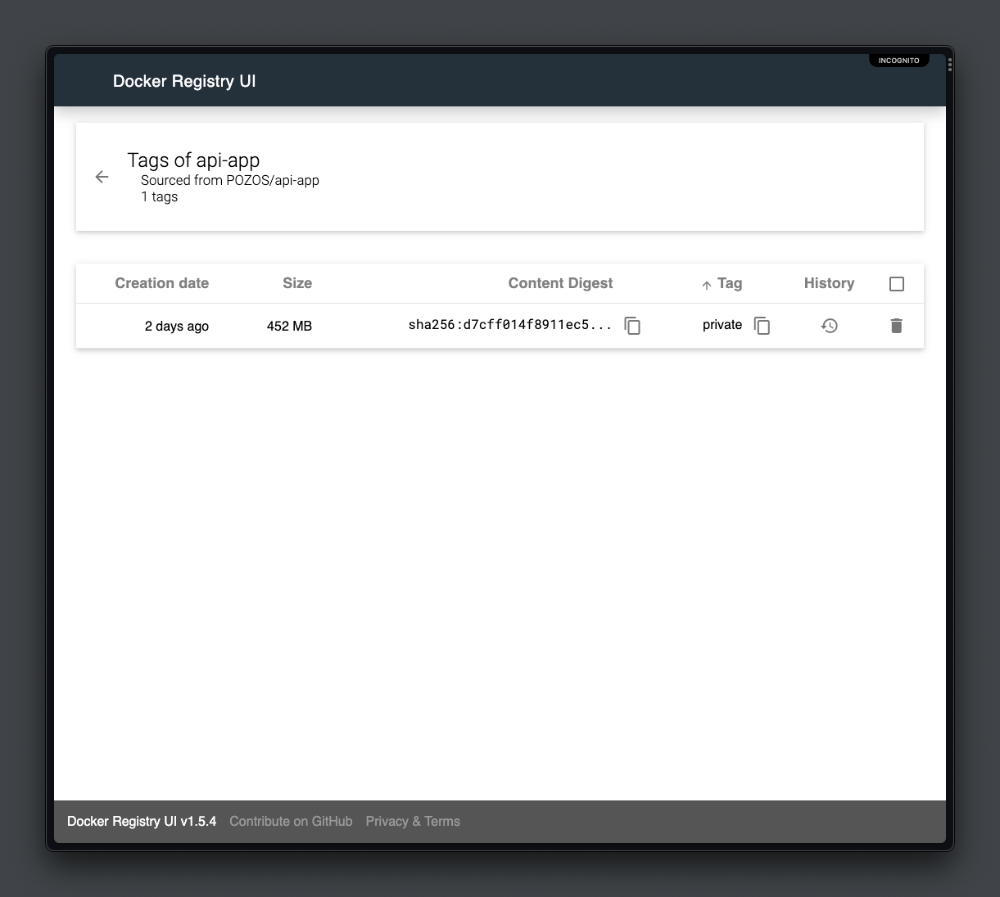
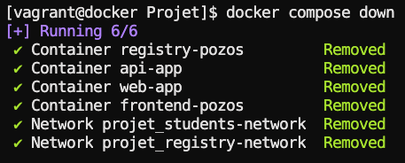

## Docker student-list

Ce mini projet est en trois partie.

La première partie consiste à déployer une application qui permet de lister les étudiants à l'aide d'un serveur web (PHP) et d'une API (Flask).

La seconde partie du projet nous amène à déployer un registre privée afin d'y pousser notre image et de la visualiser grâce à une interface web.

Enfin dans la troisième partie nous allons comporiser nos conteneurs.

### Partie 1 - Dockerfile

#### Étape 1: Création et build du Dockerfile API

Avec les commandes suivantes :

[Les instructions du Dockerfile à renseigner](https://github.com/MozkaGit/devops-bootcamp-docker/blob/85bcc103d8b1dfd28aceca5c9f986fa4f438f258/Projet/simple_api/Dockerfile)

```
git clone https://github.com/diranetafen/student-list.git
mv student_list/* .
vi simple_api/Dockerfile
docker build -f simple_api/Dockerfile -t api-app.doc simple_api/
```

Voici le résultat:

```
REPOSITORY       TAG          IMAGE ID       CREATED        SIZE
api-app.doc      latest       4471049ba97d   47 hours ago   1.12GB
```

Créons un réseau pour nos conteneurs et vérifions avec un docker network ls:

`docker network create --driver=bridge --subnet=192.168.2.0/24 students-network`

Voici le résultat:

```
NETWORK ID     NAME                DRIVER    SCOPE
c90e8e342472   students-network    bridge    local
```

#### Étape 2: Démarrage des conteneurs

On commence avec notre image précedemment créé:

`docker run --rm --name api-app --network students-network -d -v ./simple_api/:/data/ api-app.doc`

Puis montons notre partie web:

`docker run --rm --name web-app --network students-network -p 80:80 -d -v ./website/:/var/www/html -e USERNAME=toto -e PASSWORD=python php:7.2-apache`

Avec un `docker ps` vérifions que nos conteneurs sont bien actifs:

```
CONTAINER ID   IMAGE            COMMAND                  CREATED              STATUS          PORTS                               NAMES
2c50d3459466   php:7.2-apache   "docker-php-entrypoi…"   About a minute ago   Up 59 seconds   0.0.0.0:80->80/tcp, :::80->80/tcp   web-app
a342062f95aa   api-app.doc      "python ./student_ag…"   2 minutes ago        Up 2 minutes    5000/tcp                            api-app
```

#### Étape 3: Test de l'application

Modifions la ligne 29 du fichier `website/index.php`:

```
$url = 'http://<api_ip_or_name:port>/pozos/api/v1.0/get_student_ages';
```

Il faut remplacer `<api_ip_or_name:port>` par nos infos. En l'occurence `api-app:5000`

Avant de nous connecter à l'interface web, vérifions que notre serveur web puisse extraire les données de notre api avec `curl`:

`docker exec web-app curl -u toto:python -X GET http://api-app:5000/pozos/api/v1.0/get_student_ages`

Voici le résultat:



Et maintenant vérifions l'interface web:



Tous fonctionne bien, nous pouvons maintenant arrêter nos conteneurs avant de passer à la suite du projet.

### Partie 2 - Registre privé

Pour cette partie nous allons utiliser 2 images déjà créés:

1. Pour la création du registre il existe une [image officielle](https://hub.docker.com/_/registry) au nom éponyme.
2. Pour l'interface utilisateur du registre privé nous allons utilisr l'image [joxit/docker-registry-ui](https://hub.docker.com/r/joxit/docker-registry-ui).

#### Étape 1: Création des conteneurs

Créons d'abord un réseau pour nos conteneurs:
`docker network create registry-network`

Maintenant il est temps de les créer:
`docker run --rm -d -p 5001:5000 -e REGISTRY_STORAGE_DELETE_ENABLED=true --network registry-network --name registry-pozos registry:2.7`

`docker run --rm -d --name frontend-pozos -p 8090:80 --network registry-network -e REGISTRY_URL="http://registry-pozos:5000" -e DELETE_IMAGES=true -e REGISTRY_TITLE=POZOS joxit/docker-registry-ui:1.5-static`

Vérifions que nous avons accès au registre via l'interface web:



#### Étape 2: Push de l'image dans le registre privé

1. Avec un `docker image` il faut récupérer le nom ou l'ID de notre image afin de la tagger:

2. `docker tag api-app.doc localhost:5001/api-app:private`

3. Passons maintenant au push de l'image:

`docker push localhost:5001/api-app:private`

4. Notre image est bien présente:






### Partie 3 - Dockerfile

Dans cette partie nous allons créer notre docker-compose.

Il sera dédié au déploiement de nos 4 conteneurs:
- L'application de listing des étudiants.
- L'interface web de notre application de listing.
- Le registre privé.
- L'interface de notre registre privée.

#### Étape 1: Création du docker-compose.yml

1. Voici l'équivalent de tous nos arguments `docker run` dans un docker-compose.yml:

```
version: '3.3'
services:
    api-app.img:
        image: mozkadocker/student-app
        container_name: api-app
        networks:
            - students-network
        ports:
            - '5000:5000'
        volumes:
            - './simple_api/:/data/'
    
    php:
        image: 'php:7.2-apache'
        container_name: web-app
        networks: 
            - students-network
        ports:
            - '80:80'
        volumes:
            - './website/:/var/www/html'
        environment:
            - USERNAME=toto
            - PASSWORD=python
    
    registry:
        image: 'registry:2.7'
        container_name: registry-pozos
        networks:
            - registry-network
        ports:
            - '5001:5000'
        environment:
            - REGISTRY_STORAGE_DELETE_ENABLED=true

    docker-registry-ui:
        image: 'joxit/docker-registry-ui:1.5-static'
        container_name: frontend-pozos
        networks:
            - registry-network
        ports:
            - '8090:80'
        environment:
            - REGISTRY_URL=http://registry-pozos:5000
            - DELETE_IMAGES=true
            - REGISTRY_TITLE=POZOS
            - SINGLE_REGISTRY=true

networks:
  students-network:
    driver: bridge
  registry-network:
    driver: bridge
```

#### Étape 2: Exécution du docker-compose.yml

1. Exécution: 

`docker compose up -d`


2. Destruction:

